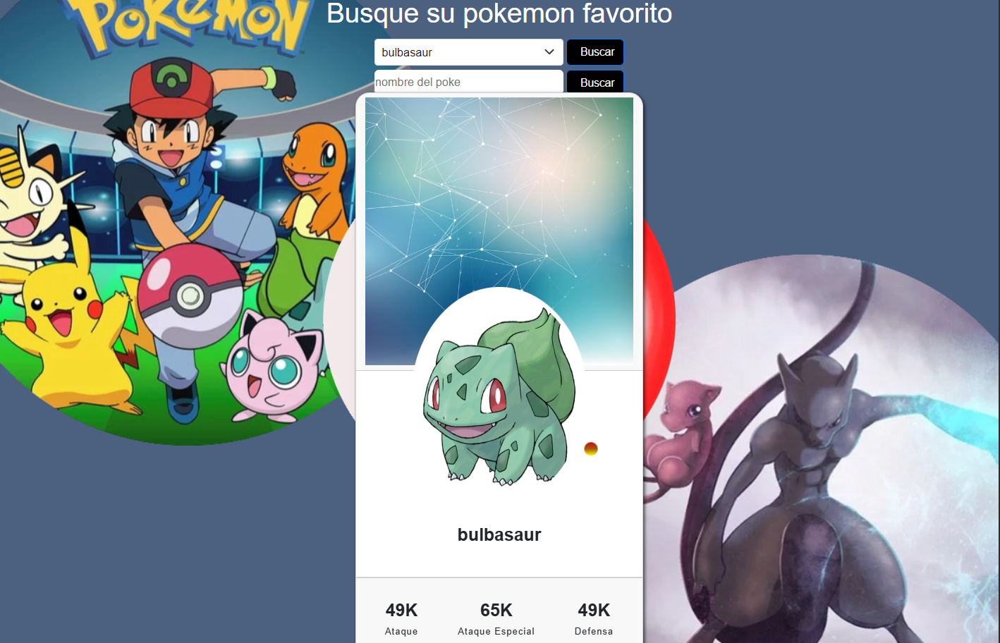

# 🐾 Proyecto Pokédex con la API de Pokémon

Este es un proyecto simple de Pokédex creado con HTML, CSS, jQuery y AJAX. Utiliza la [PokéAPI](https://pokeapi.co/) para obtener información de los Pokémon y mostrarlos dinámicamente en la página.

## Funcionalidades

- Buscar Pokémon por nombre; seleccione o escriba
- Ver imagen, estadísticas básicas
- Diseño responsive con estilos personalizados en CSS
- Carga dinámica de datos usando AJAX

## 🛠️ Tecnologías utilizadas

- **HTML5** – Estructura de la página
- **CSS3** – Estilos personalizados
- **JavaScript (jQuery)** – Manipulación del DOM y llamadas AJAX
- **[PokéAPI](https://pokeapi.co/)** – API REST gratuita de Pokémon

## Imagen del proyecto

 <!-- Puedes borrar esta línea si no tienes una imagen -->

## Cómo usar el proyecto

1. Clona el repositorio:
   ```bash
   git clone https://github.com/LuissVi/pokemon.git
